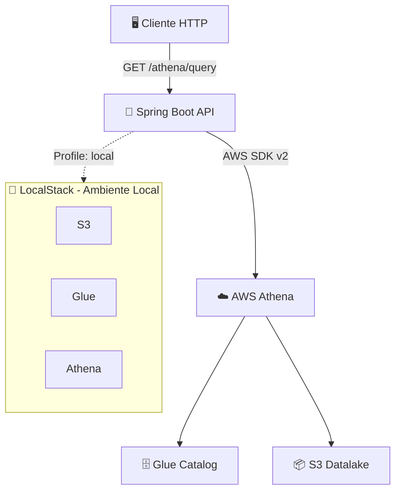

# 🧪 PoC — Spring Boot 3 + AWS Athena (Glue Catalog) + LocalStack
[](https://www.linkedin.com/in/wesleyosantos91/)

  
   
  
  


---

## 📌 Objetivo
Esta PoC demonstra como integrar uma **API REST Spring Boot (Java 21)** com o **AWS Athena**, consultando tabelas do **Glue Catalog**.  

O ambiente é parametrizável:
- **Profile `local`** → LocalStack (S3 + Glue + Athena em Docker)  
- **Profile `dev`** → AWS real (credenciais IAM / AWS Profile)

### ✨ Funcionalidades
- 🔍 Consultas SQL no AWS Athena via API REST
- 📊 Integração com Glue Data Catalog
- 🐳 Ambiente local com LocalStack
- ⚙️ Configuração multi-ambiente (local/dev)

---

## 🏗️ Arquitetura



---

## 📂 Estrutura do projeto

```
poc-athena-glue-catalog/
├── 📋 collections/
│   └── Insomnia_2025-09-04.yaml         # Collection para testes
├── 🐳 docker/
│   ├── bootstrap/
│   │   ├── 01-create-data.sh            # Script de criação do bucket e dados
│   │   └── 02-create-glue-athena.sh     # Script de configuração Glue/Athena
│   └── data/
│       └── sales.csv                    # Dados de exemplo
├── 📊 src/
│   ├── main/java/io/github/wesleyosantos91/
│   │   ├── 🚀 PocAthenaGlueCatalogApplication.java
│   │   ├── 🌐 api/v1/
│   │   │   ├── controller/AthenaController.java
│   │   │   └── response/QueryResponse.java
│   │   ├── 💼 domain/service/AthenaQueryService.java
│   │   └── ⚙️ infrastructure/
│   │       ├── athena/AthenaConfig.java
│   │       └── envs/{AppProps,AwsProps}.java
│   └── resources/
│       ├── application.yml              # Configuração base
│       ├── application-local.yml        # Configuração LocalStack
│       └── application-dev.yml          # Configuração AWS real
├── 🐳 docker-compose.yml
├── 📝 README.md
├── 🔧 pom.xml
└── 📋 exemplos_request.bash             # Exemplos de requisições
```

---

## ⚙️ Pré-requisitos

- **☕ Java 21** (JDK)
- **📦 Maven 3.9+**
- **🐳 Docker & Docker Compose**
- **☁️ AWS CLI** (opcional para validar recursos)
- **🔑 LocalStack Pro** (para funcionalidades completas do Athena)

### 🔧 Verificando pré-requisitos
```bash
java --version    # Java 21+
mvn --version     # Maven 3.9+
docker --version  # Docker 20+
```

---

## 🚀 Como rodar

### 1. 🐳 Subir LocalStack
```bash
# Clone o repositório
git clone <repo-url>
cd poc-athena-glue-catalog

# Configure o token do LocalStack Pro (necessário para Athena)
export LOCALSTACK_AUTH_TOKEN=sua-chave-aqui

# Suba os serviços
docker-compose up -d

# Verifique se está rodando
docker-compose ps
```

➡️ **Scripts de bootstrap executarão automaticamente:**
- ✅ Bucket `s3://datalake`
- ✅ Upload do arquivo `sales.csv`
- ✅ Glue Database `datalake_db` + tabela `sales`
- ✅ Athena WorkGroup `wg_local`

### 2. 🚀 Iniciar a API
```bash
# Compilar e executar
./mvnw clean compile
./mvnw spring-boot:run -Dspring-boot.run.profiles=local

# Ou usando Maven diretamente
mvn spring-boot:run -Dspring-boot.run.profiles=local
```

### 3. ✅ Verificar se está funcionando
```bash
# Health check
curl http://localhost:8080/actuator/health

# Swagger UI (documentação interativa)
open http://localhost:8080/swagger-ui/index.html
```

---

## 🧪 Testando consultas

### 📊 Consulta simples
```bash
curl --get 'http://localhost:8080/athena/query' \
  --data-urlencode 'sql=SELECT * FROM "datalake_db"."sales" LIMIT 5'
```

### 📈 Agregação por SKU
```bash
curl --get 'http://localhost:8080/athena/query' \
  --data-urlencode 'sql=SELECT sku, SUM(amount) AS total_sales, COUNT(*) AS order_count FROM "datalake_db"."sales" GROUP BY sku ORDER BY total_sales DESC LIMIT 10'
```

### 📅 Análise temporal
```bash
curl --get 'http://localhost:8080/athena/query' \
  --data-urlencode 'sql=SELECT DATE(ts) as date, SUM(amount) as daily_total FROM "datalake_db"."sales" GROUP BY DATE(ts) ORDER BY date'
```

### 📋 Exemplo de resposta
```json
{
  "queryExecutionId": "abc123-def456-789ghi",
  "count": 3,
  "rows": [
    {
      "sku": "LAPTOP-001", 
      "total_sales": "2450.00", 
      "order_count": "5"
    },
    {
      "sku": "MOUSE-PRO", 
      "total_sales": "340.50", 
      "order_count": "12"
    },
    {
      "sku": "KEYBOARD-RGB", 
      "total_sales": "180.99", 
      "order_count": "3"
    }
  ]
}
```

---

## 🌍 Executando em ambiente AWS real (`dev`)

### 1. 🔑 Configure credenciais AWS
```bash
# Opção 1: AWS CLI
aws configure

# Opção 2: Variáveis de ambiente
export AWS_ACCESS_KEY_ID=sua-chave
export AWS_SECRET_ACCESS_KEY=sua-chave-secreta
export AWS_DEFAULT_REGION=us-east-1

# Opção 3: IAM Role (recomendado para EC2/ECS)
```

### 2. ⚙️ Ajuste configurações
Edite `src/main/resources/application-dev.yml`:
```yaml
aws:
  region: us-east-1
  # endpoint não definido = usa AWS real

app:
  athena:
    database: seu_database_glue
    table: sua_tabela
    workgroup: primary
    outputS3: s3://seu-bucket-athena/query-results/
    timeoutSeconds: 300
    maxRows: 5000
```

### 3. 🚀 Execute com profile dev
```bash
./mvnw spring-boot:run -Dspring-boot.run.profiles=dev
```

---

## 📊 Monitoramento e Observabilidade

### 🔍 Health Checks
```bash
# Status geral
curl http://localhost:8080/actuator/health

# Métricas detalhadas
curl http://localhost:8080/actuator/metrics

# Informações da aplicação
curl http://localhost:8080/actuator/info
```

### 📋 Swagger UI
Acesse: http://localhost:8080/swagger-ui/index.html

### 📈 Logs estruturados
A aplicação gera logs em formato estruturado para facilitar monitoramento:
```json
{
  "timestamp": "2025-09-04T10:30:00.123Z",
  "level": "INFO",
  "logger": "AthenaQueryService",
  "message": "Query executada com sucesso",
  "queryId": "abc123-def456",
  "executionTime": "2.3s",
  "rowCount": 150
}
```

---

## 🛡️ Segurança e Boas Práticas

### ⚠️ Limitações atuais (PoC)
- ✅ Aceita apenas queries `SELECT`
- ✅ Validação básica de SQL injection
- ✅ Timeout configurável
- ✅ Limite de linhas retornadas

### 🔒 Para ambiente de produção
- 🔐 **Autenticação/Autorização**: Implementar Spring Security
- 🛡️ **Validação rigorosa**: Parser SQL para whitelist de comandos
- 💰 **Controle de custos**: Rate limiting e monitoring de queries
- 📝 **Auditoria**: Log de todas as queries executadas
- 🔍 **Monitoramento**: Métricas de performance e alertas

### 💡 Exemplo de configuração de segurança
```yaml
app:
  athena:
    security:
      allowedTables: ["datalake_db.sales", "datalake_db.customers"]
      maxQueryLength: 1000
      rateLimitPerMinute: 10
      forbiddenKeywords: ["DELETE", "UPDATE", "INSERT", "DROP"]
```

---

## 🧪 Troubleshooting

### ❌ Problemas comuns

| Problema | Solução |
|----------|---------|
| **Tabela não encontrada** | Confirme nome exato: `"datalake_db"."sales"` |
| **AccessDenied S3** | Verifique bucket de output e permissões |
| **LocalStack timeout** | Aguarde bootstrap completo (~2-3min) |
| **Query muito lenta** | LocalStack tem limitações de performance |
| **Token LocalStack** | Configure `LOCALSTACK_AUTH_TOKEN` para Athena |

### 🔍 Debug LocalStack
```bash
# Logs do LocalStack
docker-compose logs -f localstack

# Verificar recursos criados
docker exec -it localstack_main bash
awslocal s3 ls s3://datalake/
awslocal glue get-databases
awslocal athena list-work-groups
```

### 📊 Validação manual
```bash
# Teste direto no LocalStack
awslocal athena start-query-execution \
  --query-string "SELECT COUNT(*) FROM datalake_db.sales" \
  --work-group wg_local \
  --result-configuration OutputLocation=s3://datalake/athena-results/
```

---

## 🧪 Testes

### 🔄 Executar testes unitários
```bash
./mvnw test
```

### 🐳 Testes de integração com Testcontainers
```bash
./mvnw test -Dtest=*IntegrationTest
```

### 📊 Cobertura de código
```bash
./mvnw jacoco:report
open target/site/jacoco/index.html
```

---

## 📚 Dados de exemplo

O arquivo `docker/data/sales.csv` contém dados fictícios de vendas:
```csv
order_id,sku,amount,ts
ORD-001,LAPTOP-001,1299.99,2025-01-15 10:30:00
ORD-002,MOUSE-PRO,89.90,2025-01-15 11:45:00
ORD-003,KEYBOARD-RGB,159.99,2025-01-15 14:20:00
```

### 📊 Esquema da tabela
| Coluna | Tipo | Descrição |
|--------|------|-----------|
| `order_id` | string | ID único do pedido |
| `sku` | string | Código do produto |
| `amount` | double | Valor da venda |
| `ts` | string | Timestamp da transação |

---

## 📘 Referências e documentação

### 🛠️ Tecnologias utilizadas
- **[Spring Boot 3.3.2](https://spring.io/projects/spring-boot)** - Framework Java
- **[AWS SDK v2.33.2](https://sdk.amazonaws.com/java/api/latest/)** - Cliente AWS
- **[AWS Athena](https://docs.aws.amazon.com/athena/)** - Serviço de consultas
- **[AWS Glue](https://docs.aws.amazon.com/glue/)** - Catálogo de dados
- **[LocalStack](https://docs.localstack.cloud/)** - AWS local

### 📖 Artigos e tutoriais
- [AWS Athena Best Practices](https://docs.aws.amazon.com/athena/latest/ug/best-practices.html)
- [Spring Boot + AWS SDK Configuration](https://docs.spring.io/spring-cloud-aws/docs/current/reference/html/)
- [LocalStack Athena Limitations](https://docs.localstack.cloud/user-guide/aws/athena/)

---

## 🤝 Contribuindo

1. 🍴 Fork o projeto
2. 🌿 Crie uma branch (`git checkout -b feature/amazing-feature`)
3. 💾 Commit suas mudanças (`git commit -m 'Add amazing feature'`)
4. 📤 Push para a branch (`git push origin feature/amazing-feature`)
5. 🔄 Abra um Pull Request

### 📋 Checklist para PRs
- [ ] ✅ Testes passando
- [ ] 📝 Documentação atualizada
- [ ] 🧹 Código formatado
- [ ] 🔍 Code review aprovado

---

## 📄 Licença

Este projeto está sob a licença MIT. Veja o arquivo [LICENSE](LICENSE) para mais detalhes.

---

<div align="center">

### 👨‍💻 Desenvolvido por

<a href="https://www.linkedin.com/in/wesleyosantos91/" target="_blank">
  
</a>
<a href="https://github.com/wesleyosantos91" target="_blank">
  
</a>

**Wesley Oliveira Santos**

*Software Engineer | AWS Certified | Java Specialist*

</div>

---

<div align="center">
<sub>🌟 Se este projeto foi útil, considere dar uma estrela! ⭐</sub>
</div>
